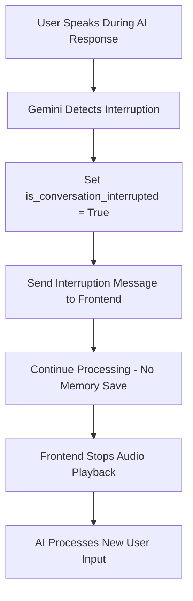
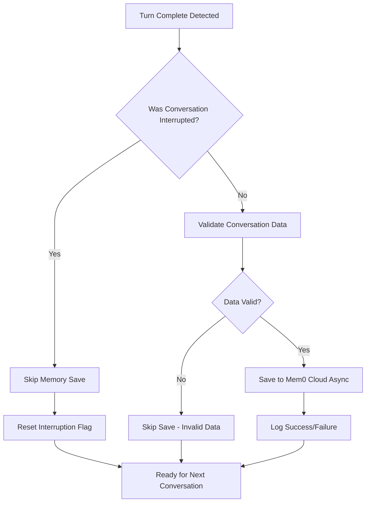
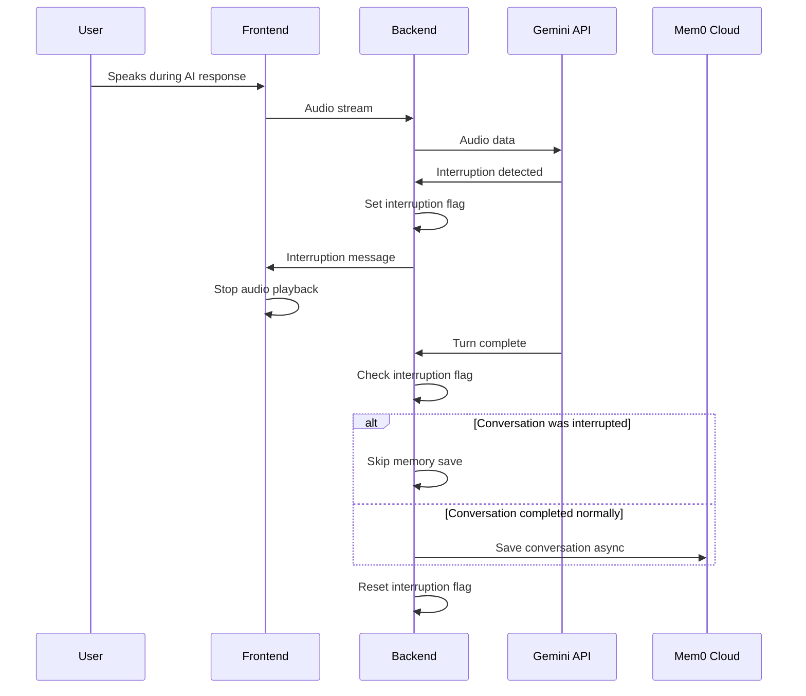

# Interruption and Memory Management System

## Overview

This document describes the robust interruption handling and conditional memory management system implemented for the Gemini Live API integration. The system ensures real-time interruption processing while maintaining high-quality conversation memory through conditional saving logic.

## Core Architecture

### Business Logic Principle

The system operates on a fundamental business rule: **interruption equals rejection**. When a user interrupts the AI during speech generation, it indicates they are rejecting or ignoring that response. Therefore, interrupted conversations should not be saved to memory as they represent incomplete or unwanted interactions.

### System Components

1. **Interruption Detection**: Real-time detection of user speech during AI generation
2. **Memory Management**: Conditional saving based on conversation completion status
3. **Voice Activity Detection (VAD)**: Optimized parameters for responsive interruption
4. **Asynchronous Processing**: Non-blocking memory operations

## Interruption Handling System

### Implementation Details

The interruption system follows a simplified, non-blocking approach:

```python
# Interruption flag in GeminiConnection class
self.is_conversation_interrupted = False

# Interruption detection and immediate processing
if response["serverContent"]["interrupted"]:
    gemini.is_conversation_interrupted = True
    await websocket.send_json({"interrupted": "True"})
    continue  # Non-blocking continuation
```

### Key Features

- **Immediate Processing**: Interruptions are processed instantly without waiting for memory operations
- **Flag-Based Tracking**: Simple boolean flag tracks conversation interruption state
- **Non-Blocking Design**: No memory operations during interruption processing
- **Frontend Notification**: Immediate WebSocket message to frontend for audio stopping

### Flow Diagram



## Memory Management System

### Conditional Saving Logic

The memory system implements conditional saving based on conversation completion:

```python
if response["serverContent"]["turnComplete"]:
    if gemini.is_conversation_interrupted:
        print("Skipping memory save - conversation was interrupted")
        gemini.is_conversation_interrupted = False  # Reset flag
    else:
        # Save complete conversation asynchronously
        asyncio.create_task(save_complete_conversation())
```

### Memory Quality Assurance

- **Complete Conversations Only**: Only finished, uninterrupted conversations are saved
- **Data Integrity**: Prevents pollution of memory with partial responses
- **Context Accuracy**: Maintains accurate conversation history for future sessions
- **Asynchronous Operations**: All memory saves are non-blocking

### Memory Flow Diagram



## Voice Activity Detection (VAD) Configuration

### Optimized Parameters

The VAD system uses carefully tuned parameters for responsive interruption:

```json
{
  "start_of_speech_sensitivity": "START_SENSITIVITY_HIGH",
  "end_of_speech_sensitivity": "END_SENSITIVITY_HIGH", 
  "prefix_padding_ms": 5,
  "silence_duration_ms": 45
}
```

### Parameter Explanation

- **start_of_speech_sensitivity**: HIGH for immediate user speech detection
- **end_of_speech_sensitivity**: HIGH for quick interruption triggering
- **prefix_padding_ms**: 5ms minimal padding for performance
- **silence_duration_ms**: 45ms optimal balance between responsiveness and stability

### VAD Tuning Considerations

- Lower silence_duration_ms values increase interruption sensitivity
- Higher sensitivity values improve real-time responsiveness
- Balance required between interruption speed and false positive prevention

## System Integration

### Complete System Flow



### Error Handling

- **Memory Save Failures**: Do not affect interruption processing
- **WebSocket Errors**: Graceful degradation without system failure
- **Async Operation Errors**: Logged but do not block real-time processing
- **Flag State Management**: Automatic reset ensures system consistency

## Performance Characteristics

### Interruption Response Time

- **Detection Latency**: Sub-50ms with optimized VAD parameters
- **Processing Time**: Immediate flag setting and message sending
- **Audio Stop Time**: Frontend receives interruption within 10-20ms
- **Recovery Time**: Instant readiness for new user input

### Memory Operation Performance

- **Async Processing**: Zero blocking of real-time operations
- **Conditional Logic**: Eliminates unnecessary memory operations
- **Error Isolation**: Memory failures do not impact interruption system
- **Resource Efficiency**: Reduced memory API calls through conditional saving

## Configuration and Maintenance

### Key Configuration Points

1. **VAD Parameters**: Adjust silence_duration_ms for different use cases
2. **Memory Validation**: Modify minimum message length requirements
3. **Error Handling**: Configure logging levels and error reporting
4. **Session Management**: Adjust session timeout and cleanup intervals

### Monitoring and Debugging

- **Interruption Logs**: Track interruption frequency and response times
- **Memory Save Logs**: Monitor save success rates and failure reasons
- **Performance Metrics**: Measure end-to-end interruption latency
- **System Health**: Monitor WebSocket connection stability

## Best Practices

### Development Guidelines

1. **Never Block Interruptions**: Ensure all interruption code paths are non-blocking
2. **Validate Memory Data**: Always check data quality before saving
3. **Handle Async Errors**: Implement proper error handling for async operations
4. **Test Edge Cases**: Verify behavior with rapid interruptions and network issues
5. **Monitor Performance**: Track system metrics in production environments

### Troubleshooting Common Issues

- **Slow Interruptions**: Check VAD parameters and network latency
- **Memory Save Failures**: Verify Mem0 API connectivity and authentication
- **Audio Continuation**: Ensure frontend properly handles interruption messages
- **Flag State Issues**: Verify proper flag reset in all code paths
