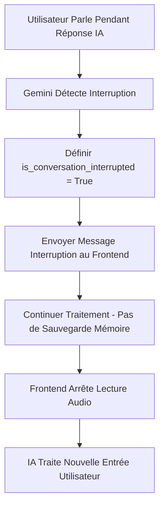
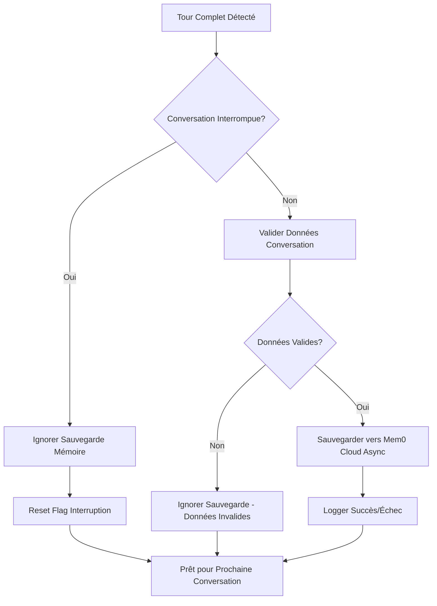
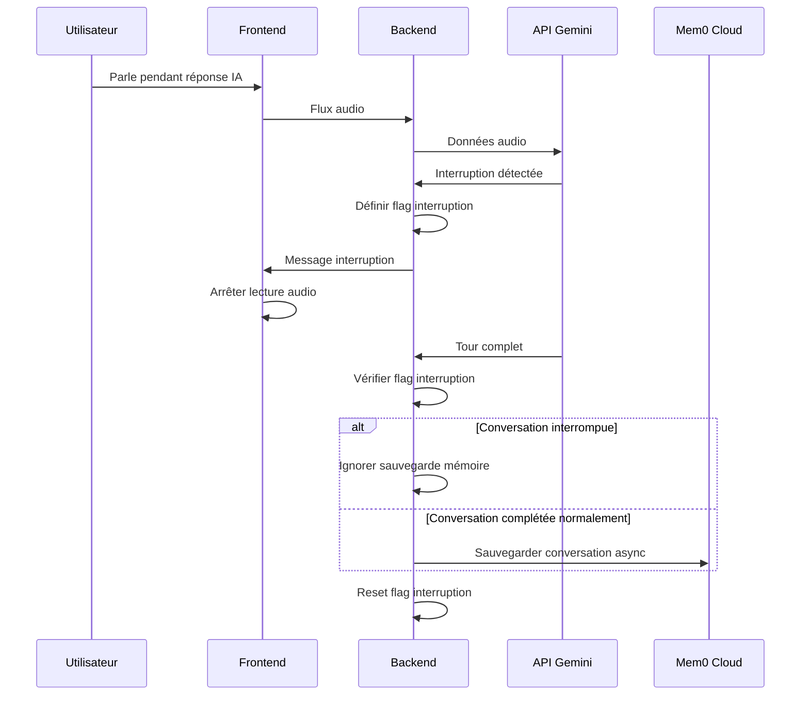

# Système de Gestion des Interruptions et de la Mémoire

## Vue d'ensemble

Ce document décrit le système robuste de gestion des interruptions et de sauvegarde conditionnelle de la mémoire implémenté pour l'intégration de l'API Gemini Live. Le système assure un traitement des interruptions en temps réel tout en maintenant une mémoire conversationnelle de haute qualité grâce à une logique de sauvegarde conditionnelle.

## Architecture Centrale

### Principe de Logique Métier

Le système fonctionne sur une règle métier fondamentale : **interruption égale rejet**. Lorsqu'un utilisateur interrompt l'IA pendant la génération de parole, cela indique qu'il rejette ou ignore cette réponse. Par conséquent, les conversations interrompues ne doivent pas être sauvegardées en mémoire car elles représentent des interactions incomplètes ou non désirées.

### Composants du Système

1. **Détection d'Interruption** : Détection en temps réel de la parole utilisateur pendant la génération IA
2. **Gestion de Mémoire** : Sauvegarde conditionnelle basée sur le statut de complétion de conversation
3. **Détection d'Activité Vocale (VAD)** : Paramètres optimisés pour une interruption réactive
4. **Traitement Asynchrone** : Opérations mémoire non-bloquantes

## Système de Gestion des Interruptions

### Détails d'Implémentation

Le système d'interruption suit une approche simplifiée et non-bloquante :

```python
# Flag d'interruption dans la classe GeminiConnection
self.is_conversation_interrupted = False

# Détection d'interruption et traitement immédiat
if response["serverContent"]["interrupted"]:
    gemini.is_conversation_interrupted = True
    await websocket.send_json({"interrupted": "True"})
    continue  # Continuation non-bloquante
```

### Caractéristiques Clés

- **Traitement Immédiat** : Les interruptions sont traitées instantanément sans attendre les opérations mémoire
- **Suivi par Flag** : Un simple flag booléen suit l'état d'interruption de conversation
- **Conception Non-Bloquante** : Aucune opération mémoire pendant le traitement d'interruption
- **Notification Frontend** : Message WebSocket immédiat au frontend pour arrêter l'audio

### Diagramme de Flux



## Système de Gestion de Mémoire

### Logique de Sauvegarde Conditionnelle

    Le système mémoire implémente une sauvegarde conditionnelle basée sur la complétion de conversation :

```python
if response["serverContent"]["turnComplete"]:
    if gemini.is_conversation_interrupted:
        print("Ignorer sauvegarde mémoire - conversation interrompue")
        gemini.is_conversation_interrupted = False  # Reset flag
    else:
        # Sauvegarder conversation complète de manière asynchrone
        asyncio.create_task(save_complete_conversation())
```

### Assurance Qualité Mémoire

- **Conversations Complètes Uniquement** : Seules les conversations finies et non-interrompues sont sauvegardées
- **Intégrité des Données** : Empêche la pollution de la mémoire avec des réponses partielles
- **Précision du Contexte** : Maintient un historique conversationnel précis pour les sessions futures
- **Opérations Asynchrones** : Toutes les sauvegardes mémoire sont non-bloquantes

### Diagramme de Flux Mémoire



## Configuration Détection d'Activité Vocale (VAD)

### Paramètres Optimisés

Le système VAD utilise des paramètres soigneusement ajustés pour une interruption réactive :

```json
{
  "start_of_speech_sensitivity": "START_SENSITIVITY_HIGH",
  "end_of_speech_sensitivity": "END_SENSITIVITY_HIGH", 
  "prefix_padding_ms": 5,
  "silence_duration_ms": 45
}
```

### Explication des Paramètres

- **start_of_speech_sensitivity** : HIGH pour détection immédiate de parole utilisateur
- **end_of_speech_sensitivity** : HIGH pour déclenchement rapide d'interruption
- **prefix_padding_ms** : 5ms padding minimal pour performance
- **silence_duration_ms** : 45ms équilibre optimal entre réactivité et stabilité

### Considérations d'Ajustement VAD

- Des valeurs silence_duration_ms plus basses augmentent la sensibilité d'interruption
- Des valeurs de sensibilité plus élevées améliorent la réactivité temps réel
- Équilibre requis entre vitesse d'interruption et prévention de faux positifs

## Intégration Système

### Flux Système Complet



### Gestion d'Erreurs

- **Échecs Sauvegarde Mémoire** : N'affectent pas le traitement d'interruption
- **Erreurs WebSocket** : Dégradation gracieuse sans échec système
- **Erreurs Opération Async** : Loggées mais ne bloquent pas le traitement temps réel
- **Gestion État Flag** : Reset automatique assure cohérence système

## Caractéristiques de Performance

### Temps de Réponse Interruption

- **Latence Détection** : Sub-50ms avec paramètres VAD optimisés
- **Temps Traitement** : Définition flag immédiate et envoi message
- **Temps Arrêt Audio** : Frontend reçoit interruption en 10-20ms
- **Temps Récupération** : Disponibilité instantanée pour nouvelle entrée utilisateur

### Performance Opération Mémoire

- **Traitement Async** : Zéro blocage des opérations temps réel
- **Logique Conditionnelle** : Élimine opérations mémoire inutiles
- **Isolation Erreur** : Échecs mémoire n'impactent pas système interruption
- **Efficacité Ressource** : Appels API mémoire réduits via sauvegarde conditionnelle

## Configuration et Maintenance

### Points de Configuration Clés

1. **Paramètres VAD** : Ajuster silence_duration_ms pour différents cas d'usage
2. **Validation Mémoire** : Modifier exigences longueur message minimum
3. **Gestion Erreur** : Configurer niveaux logging et rapport erreur
4. **Gestion Session** : Ajuster timeout session et intervalles nettoyage

### Surveillance et Débogage

- **Logs Interruption** : Suivre fréquence interruption et temps réponse
- **Logs Sauvegarde Mémoire** : Surveiller taux succès sauvegarde et raisons échec
- **Métriques Performance** : Mesurer latence interruption bout-en-bout
- **Santé Système** : Surveiller stabilité connexion WebSocket

## Meilleures Pratiques

### Directives Développement

1. **Ne Jamais Bloquer Interruptions** : Assurer tous chemins code interruption non-bloquants
2. **Valider Données Mémoire** : Toujours vérifier qualité données avant sauvegarde
3. **Gérer Erreurs Async** : Implémenter gestion erreur appropriée pour opérations async
4. **Tester Cas Limites** : Vérifier comportement avec interruptions rapides et problèmes réseau
5. **Surveiller Performance** : Suivre métriques système en environnements production

### Dépannage Problèmes Courants

- **Interruptions Lentes** : Vérifier paramètres VAD et latence réseau
- **Échecs Sauvegarde Mémoire** : Vérifier connectivité API Mem0 et authentification
- **Continuation Audio** : Assurer frontend gère correctement messages interruption
- **Problèmes État Flag** : Vérifier reset flag approprié dans tous chemins code
