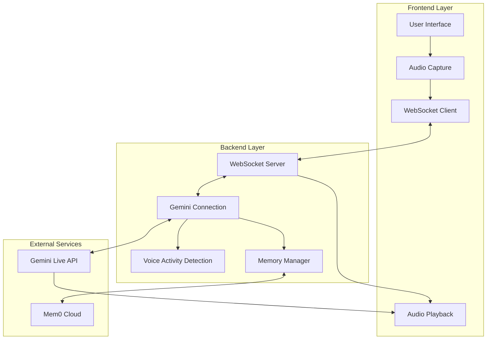
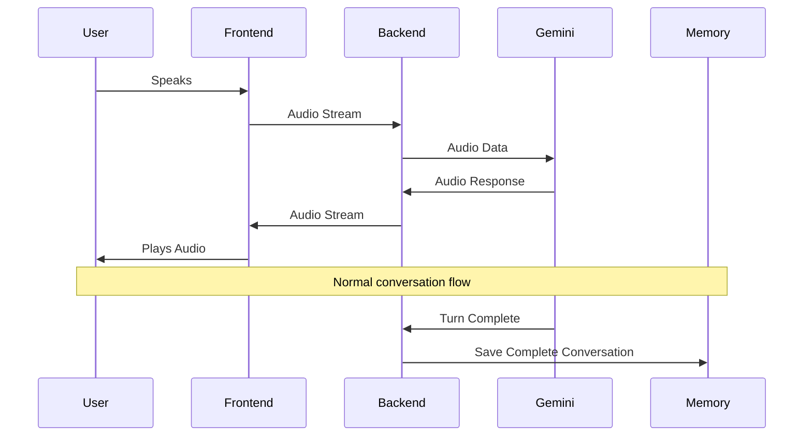
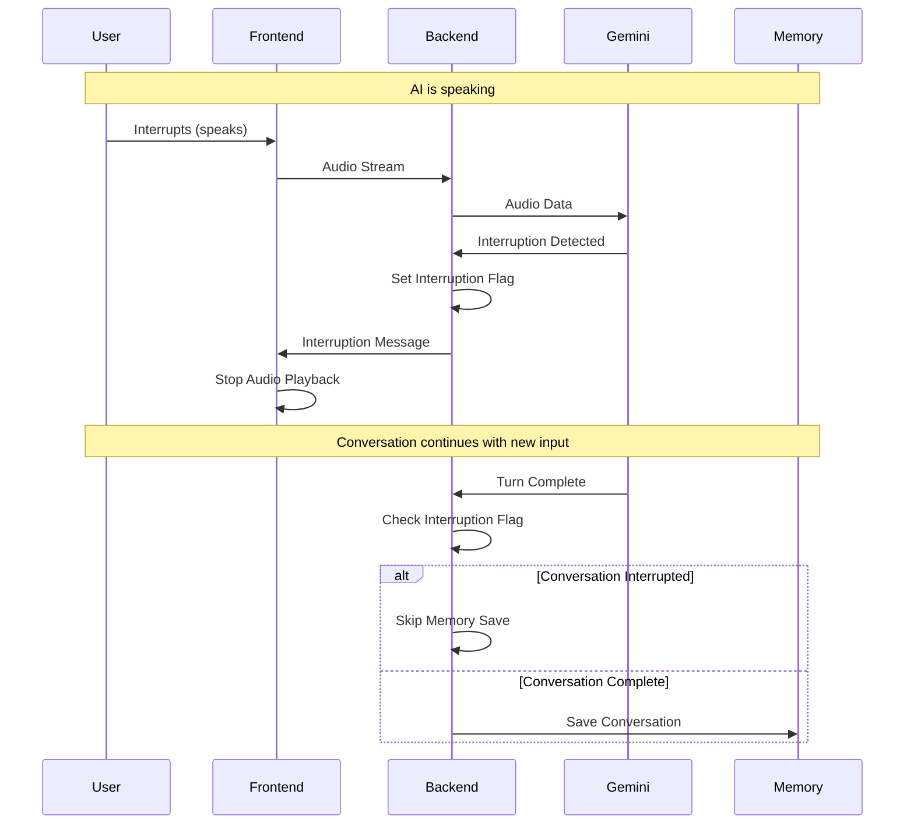
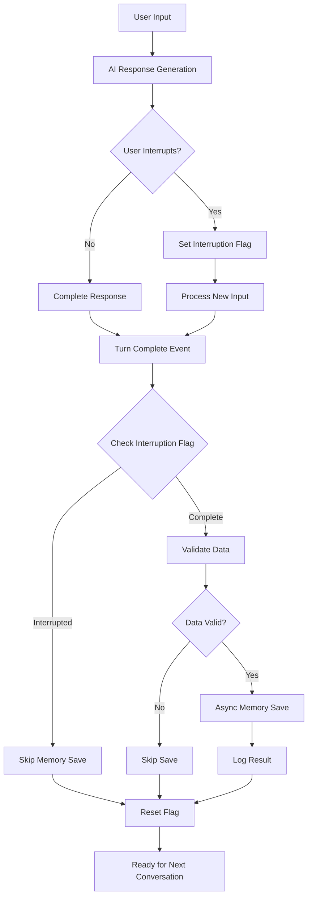
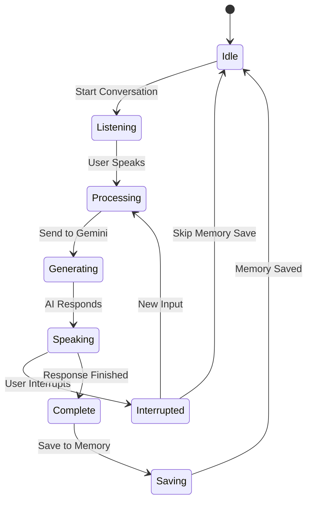
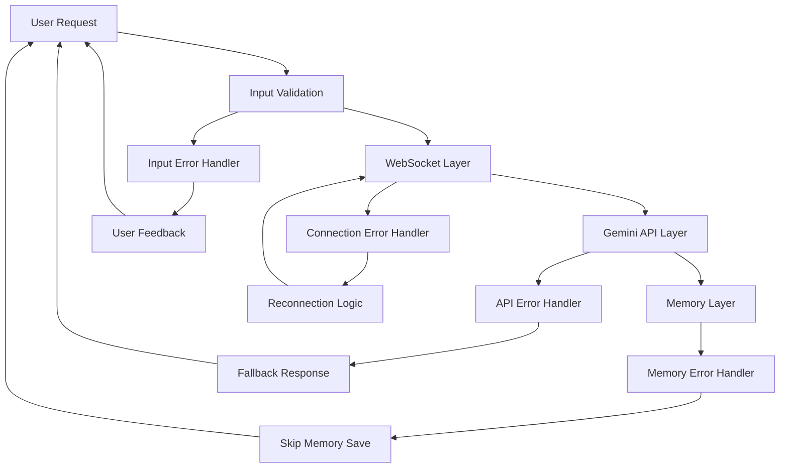
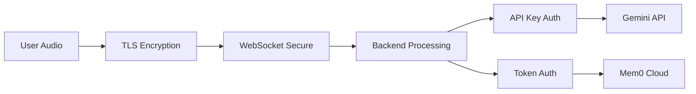
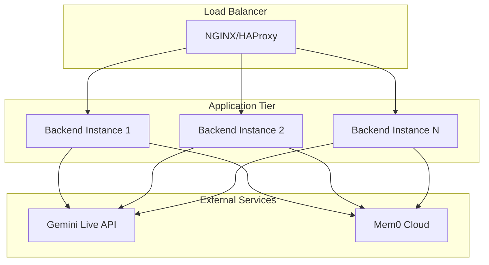

# System Architecture Documentation

## Overview

This document provides a comprehensive overview of the Gemini Live API integration architecture, focusing on the interaction between interruption handling, memory management, and real-time audio processing.

## High-Level Architecture



## Component Interactions

### Real-Time Audio Flow



### Interruption Flow



## Data Flow Architecture

### Memory Management Data Flow



## Technical Implementation Details

### GeminiConnection Class Structure

```python
class GeminiConnection:
    def __init__(self):
        # Audio data accumulation
        self.accumulated_pcm_data = []
        self.accumulated_user_pcm_data = []
        
        # Transcription accumulation
        self.accumulated_input_transcription = []
        self.accumulated_output_transcription = []
        
        # Memory management
        self.is_conversation_interrupted = False  # Key flag
        self.memory_manager = None
        self.session_id = None
        
        # Connection management
        self.ws = None
        self.token_count = 0
```

### Key System States



## Performance Characteristics

### Latency Measurements

| Operation | Target Latency | Typical Latency |
|-----------|---------------|-----------------|
| Interruption Detection | < 50ms | 20-30ms |
| Audio Stop Command | < 20ms | 10-15ms |
| Memory Save (Async) | Non-blocking | 200-500ms |
| VAD Response | < 45ms | 25-35ms |
| WebSocket Message | < 10ms | 5-8ms |

### System Throughput

- **Concurrent Sessions**: Up to 3 (Gemini Live API limit)
- **Audio Processing**: Real-time 24kHz PCM
- **Memory Operations**: Unlimited (async, non-blocking)
- **Message Rate**: 100+ messages/second per session

## Error Handling Strategy

### Error Isolation Layers



### Error Recovery Mechanisms

1. **WebSocket Disconnection**: Automatic reconnection with exponential backoff
2. **Gemini API Errors**: Graceful degradation with user notification
3. **Memory Save Failures**: Log error, continue operation without blocking
4. **Audio Processing Errors**: Reset audio pipeline, maintain conversation state

## Scalability Considerations

### Horizontal Scaling

- **Stateless Design**: Each WebSocket connection is independent
- **Session Isolation**: Memory and state per session
- **Load Balancing**: WebSocket connections can be distributed
- **Resource Management**: Memory operations are async and non-blocking

### Vertical Scaling

- **Memory Usage**: Bounded by active session count
- **CPU Usage**: Optimized for real-time audio processing
- **Network Bandwidth**: Efficient binary audio streaming
- **Storage**: Persistent memory in external Mem0 service

## Security Architecture

### Data Protection



### Security Measures

1. **Transport Security**: All communications over TLS/WSS
2. **API Authentication**: Secure API key management
3. **Session Isolation**: No cross-session data leakage
4. **Memory Privacy**: User-specific memory spaces
5. **Error Information**: No sensitive data in error messages

## Monitoring and Observability

### Key Metrics

- **Interruption Response Time**: Time from user speech to audio stop
- **Memory Save Success Rate**: Percentage of successful memory operations
- **WebSocket Connection Stability**: Connection uptime and reconnection frequency
- **Audio Quality Metrics**: Latency, dropouts, and synchronization
- **System Resource Usage**: CPU, memory, and network utilization

### Logging Strategy

```python
# Interruption Events
print(f"[{time.time()}] Generation interrupted by user activity")
print("Conversation marked as interrupted - will not be saved to memory")

# Memory Operations
print("Saving complete conversation - User: {user_text[:50]}...")
print("Complete conversation saved to memory with ID: {memory_id}")

# System Health
print("Turn complete detected - processing memory save")
print("Skipping memory save - conversation was interrupted")
```

## Configuration Management

### Environment Variables

```bash
# API Configuration
GEMINI_API_KEY=your_gemini_api_key
MEM0_API_KEY=your_mem0_api_key

# System Configuration
VAD_SILENCE_DURATION=45
VAD_SENSITIVITY=HIGH
MEMORY_SAVE_TIMEOUT=5000

# Connection Configuration
WEBSOCKET_TIMEOUT=30
RECONNECTION_ATTEMPTS=3
```

### Runtime Configuration

- **VAD Parameters**: Adjustable per deployment environment
- **Memory Thresholds**: Configurable minimum message lengths
- **Error Handling**: Configurable retry counts and timeouts
- **Logging Levels**: Environment-specific verbosity settings

## Deployment Architecture

### Production Deployment



### Deployment Considerations

1. **Session Affinity**: WebSocket connections require sticky sessions
2. **Health Checks**: Monitor WebSocket endpoint availability
3. **Resource Limits**: Configure appropriate CPU and memory limits
4. **Auto-scaling**: Scale based on active WebSocket connections
5. **Backup Strategy**: Memory data is stored in external Mem0 service
