# 🏗️ Architecture de Scalabilité - Gemini Live SaaS

## 📋 Table des Matières

1. [Vue d'ensemble](#vue-densemble)
2. [Architecture Actuelle](#architecture-actuelle)
3. [Limitations Identifiées](#limitations-identifiées)
4. [Solutions de Scalabilité](#solutions-de-scalabilité)
5. [Architecture Future Recommandée](#architecture-future-recommandée)
6. [Stratégies de Rotation d'API](#stratégies-de-rotation-dapi)
7. [Plan de Migration](#plan-de-migration)
8. [Considérations Techniques](#considérations-techniques)

---

## 🎯 Vue d'ensemble

Ce document présente l'analyse complète de l'architecture de scalabilité pour l'application **Gemini Live SaaS**, en tenant compte des limitations actuelles de l'API Gemini en version expérimentale et des stratégies futures pour une mise à l'échelle robuste.

### Contexte Actuel
- **Version** : Bêta de démonstration
- **API Gemini** : Version expérimentale avec limitations strictes
- **Objectif** : Préparer l'architecture pour une scalabilité future
- **Contrainte principale** : Maximum 3 sessions WebSocket simultanées par clé API

---

## 🏛️ Architecture Actuelle

### Diagramme de l'Architecture Existante

```mermaid
graph TB
    subgraph "Frontend - Next.js Web App"
        UI1[Interface Audio]
        UI2[Interface Video] 
        UI3[Interface Screen Share]
        SETTINGS[Paramètres Utilisateur]
    end
    
    subgraph "Backend - FastAPI"
        WS[WebSocket Endpoint /ws/{client_id}]
        API[REST APIs]
        CONN[Connections Manager]
        MEMORY[Memory System]
    end
    
    subgraph "Services Externes"
        GEMINI[Gemini Live API]
        POSTGRES[PostgreSQL]
        MEM0[Mem0 Cloud]
    end
    
    UI1 --> WS
    UI2 --> WS
    UI3 --> WS
    SETTINGS --> API
    
    WS --> CONN
    API --> POSTGRES
    CONN --> GEMINI
    MEMORY --> MEM0
    
    style GEMINI fill:#ff6b6b,stroke:#333,stroke-width:2px
    style WS fill:#4ecdc4
    style CONN fill:#45b7d1
```

### Flux de Données Actuel

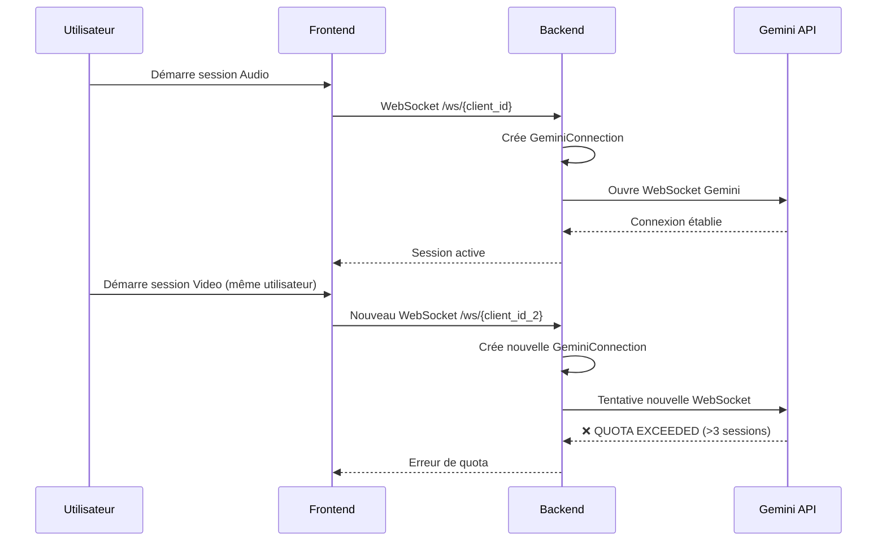

### Composants Actuels

#### 1. **Frontend (Next.js)**
- **Interfaces multiples** : Audio, Video, Screen Share
- **Gestion d'état locale** : Chaque interface a son propre état
- **WebSocket client** : Connexion directe au backend
- **Paramètres utilisateur** : Stockage et synchronisation

#### 2. **Backend (FastAPI)**
- **WebSocket endpoint** : `/ws/{client_id}` pour chaque session
- **GeminiConnection** : Une instance par session utilisateur
- **Session tracking** : Dictionnaire en mémoire des sessions actives
- **APIs REST** : Gestion des paramètres et statistiques

#### 3. **Limitations Actuelles**
- **Pas de gestion de quota** : Aucune limitation côté serveur
- **Sessions multiples** : Un utilisateur peut ouvrir plusieurs sessions simultanément
- **Pas de monitoring** : Aucune visibilité sur l'utilisation des quotas Gemini

---

## ⚠️ Limitations Identifiées

### 1. **Limitations de l'API Gemini (Version Expérimentale)**

| Limitation | Valeur Actuelle | Impact |
|------------|-----------------|---------|
| Sessions WebSocket simultanées | **3 maximum** | Bloque l'application après 3 utilisateurs |
| Gestion d'erreurs | **Blocage complet** | Aucune récupération automatique |
| Monitoring | **Aucun** | Impossible de prévoir les dépassements |
| Coût | **Gratuit mais limité** | Non viable pour production |

### 2. **Problèmes Architecturaux**

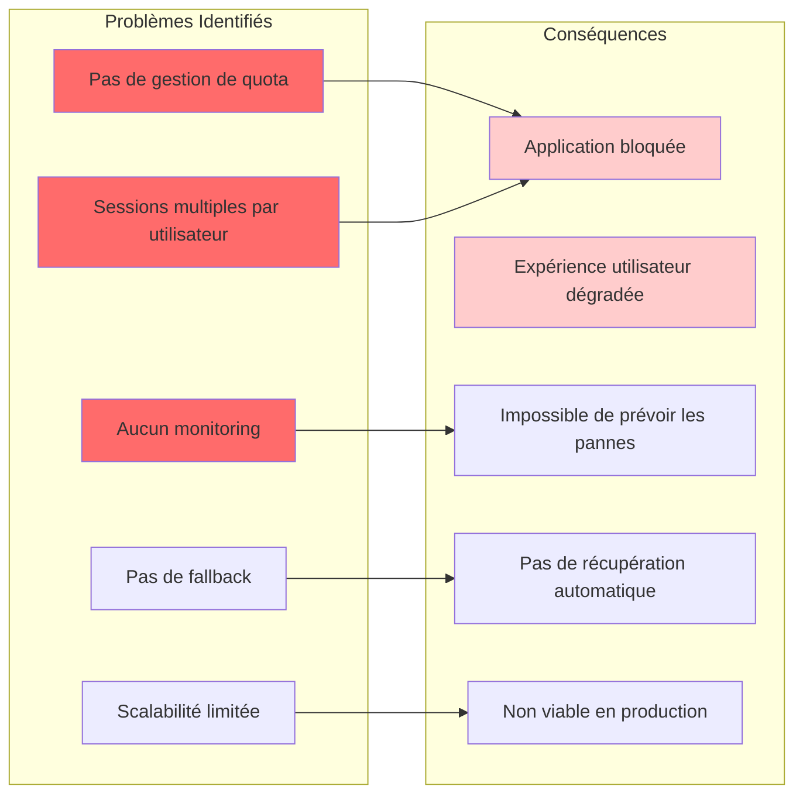

### 3. **Scénarios de Défaillance**

#### Scénario 1 : Dépassement de Quota Simple
```
Utilisateur 1 : Audio + Video + Screen = 3 sessions ✅
Utilisateur 2 : Audio = 1 session ❌ QUOTA EXCEEDED
```

#### Scénario 2 : Sessions Multiples
```
3 utilisateurs avec 1 session chacun = 3 sessions ✅
1 utilisateur supplémentaire = ❌ QUOTA EXCEEDED
```

#### Scénario 3 : Blocage Complet
```
Quota dépassé → API Gemini bloque → Application inutilisable
Aucune récupération automatique → Redémarrage manuel requis
```

---

## 🚀 Solutions de Scalabilité

### 1. **Solution Immédiate : Documentation et Limitations**

Pour la version bêta actuelle, nous recommandons de :

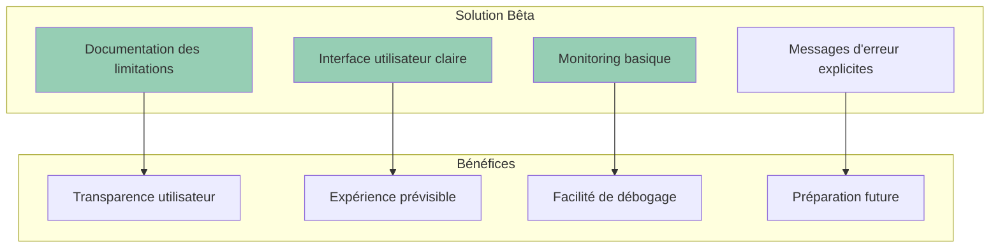

### 2. **Solution Future : Rotation Multi-API**

#### Architecture avec Rotation de Clés API

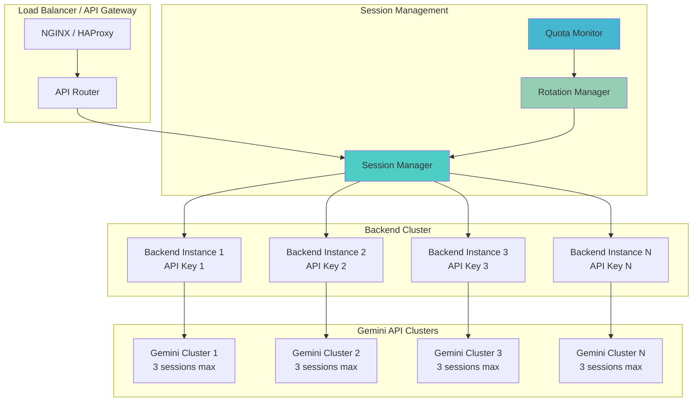

### 3. **Stratégies de Rotation Avancées**

#### Vue d'Ensemble des Stratégies de Rotation

```mermaid
graph TB
    subgraph "🔄 STRATÉGIE 1: Round-Robin Simple"
        RR_REQ[Nouvelle Requête]
        RR_ALGO[Algorithme Round-Robin]
        RR_K1[API Key 1<br/>2/3 sessions]
        RR_K2[API Key 2<br/>1/3 sessions]
        RR_K3[API Key 3<br/>0/3 sessions]

        RR_REQ --> RR_ALGO
        RR_ALGO --> RR_K3

        style RR_K3 fill:#96ceb4
        style RR_ALGO fill:#4ecdc4
    end

    subgraph "⚖️ STRATÉGIE 2: Load-Based Intelligent"
        LB_REQ[Nouvelle Requête]
        LB_MONITOR[Monitoring Temps Réel]
        LB_ALGO[Algorithme Pondéré]
        LB_K1[API Key 1<br/>Charge: 67%<br/>Latence: 120ms]
        LB_K2[API Key 2<br/>Charge: 33%<br/>Latence: 80ms]
        LB_K3[API Key 3<br/>Charge: 100%<br/>Latence: 200ms]
        LB_K4[API Key 4<br/>Charge: 0%<br/>Latence: 60ms]

        LB_REQ --> LB_MONITOR
        LB_MONITOR --> LB_ALGO
        LB_ALGO --> LB_K4

        style LB_K3 fill:#ff6b6b
        style LB_K4 fill:#96ceb4
        style LB_ALGO fill:#45b7d1
    end

    subgraph "🌍 STRATÉGIE 3: Géographique + Fallback"
        GEO_US[Utilisateurs US]
        GEO_EU[Utilisateurs EU]
        GEO_ASIA[Utilisateurs ASIA]

        GEO_CLUSTER_US[Cluster US<br/>API Keys 1-3]
        GEO_CLUSTER_EU[Cluster EU<br/>API Keys 4-6]
        GEO_CLUSTER_ASIA[Cluster ASIA<br/>API Keys 7-9]

        GEO_FALLBACK[Fallback Global<br/>Cross-Zone]

        GEO_US --> GEO_CLUSTER_US
        GEO_EU --> GEO_CLUSTER_EU
        GEO_ASIA --> GEO_CLUSTER_ASIA

        GEO_CLUSTER_US --> GEO_FALLBACK
        GEO_CLUSTER_EU --> GEO_FALLBACK
        GEO_CLUSTER_ASIA --> GEO_FALLBACK

        style GEO_CLUSTER_US fill:#4ecdc4
        style GEO_CLUSTER_EU fill:#45b7d1
        style GEO_CLUSTER_ASIA fill:#96ceb4
        style GEO_FALLBACK fill:#feca57
    end

    subgraph "📊 MÉTRIQUES DE DÉCISION"
        M1[Sessions Actives]
        M2[Latence Moyenne]
        M3[Taux d'Erreur]
        M4[Charge CPU]
        M5[Disponibilité Zone]

        DECISION[Algorithme de Décision]

        M1 --> DECISION
        M2 --> DECISION
        M3 --> DECISION
        M4 --> DECISION
        M5 --> DECISION

        style DECISION fill:#ff9ff3
    end
```

#### A. **Rotation Round-Robin**
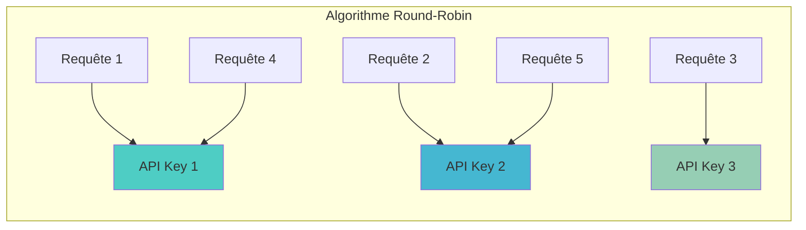

#### B. **Rotation par Charge**
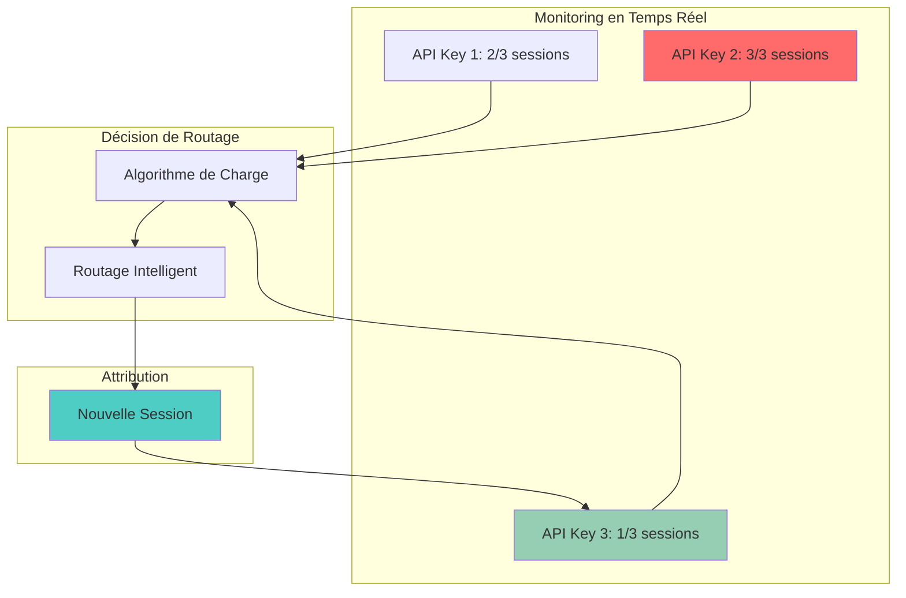

---

## 🎯 Architecture Future Recommandée

### Vue d'Ensemble de l'Architecture Scalable

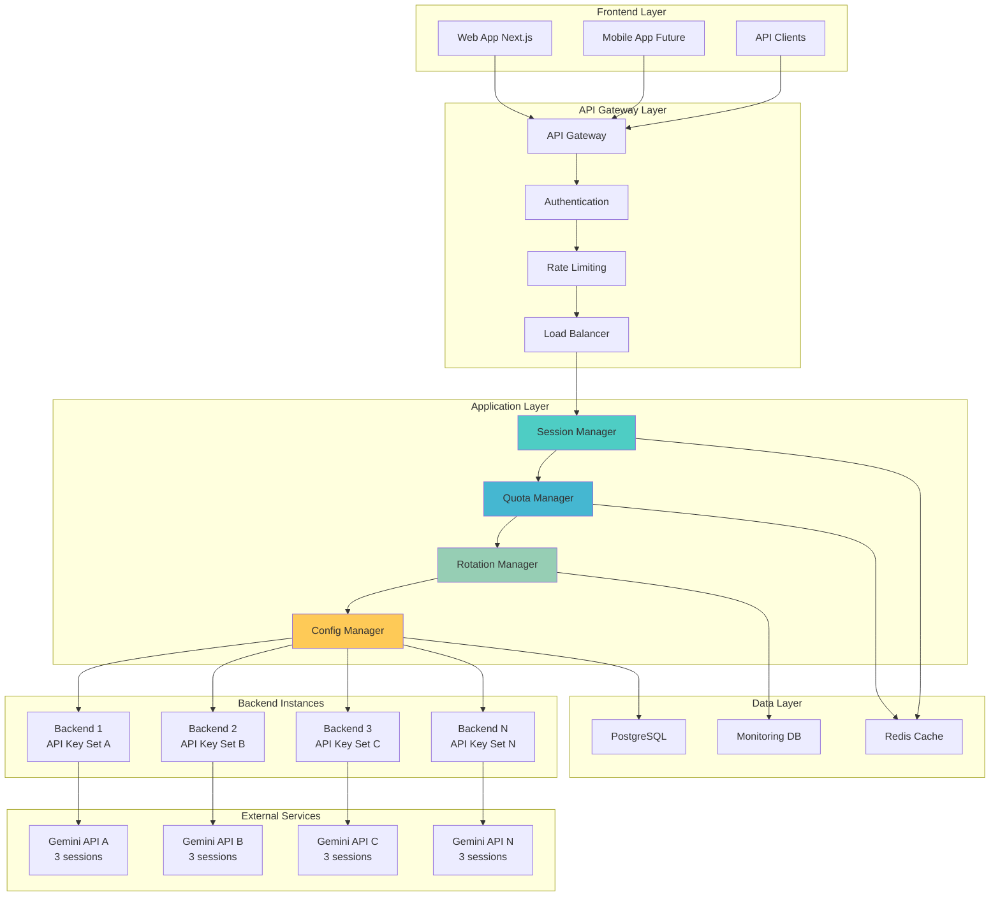

### Composants Détaillés de l'Architecture Future

#### 1. **Session Manager**
```typescript
interface SessionManager {
  // Gestion des sessions utilisateur
  createSession(userId: string, mode: SessionMode): Promise<SessionResult>
  terminateSession(sessionId: string): Promise<void>
  switchMode(sessionId: string, newMode: SessionMode): Promise<SessionResult>

  // Monitoring des sessions actives
  getActiveSessions(): SessionInfo[]
  getUserSessions(userId: string): SessionInfo[]
  getSessionsByMode(mode: SessionMode): SessionInfo[]
}
```

#### 2. **Quota Manager**
```typescript
interface QuotaManager {
  // Gestion des quotas par API Key
  checkQuotaAvailability(apiKeyId: string): Promise<QuotaStatus>
  reserveQuotaSlot(apiKeyId: string): Promise<QuotaReservation>
  releaseQuotaSlot(reservationId: string): Promise<void>

  // Monitoring des quotas
  getQuotaUsage(): QuotaUsageReport
  predictQuotaExhaustion(): QuotaPrediction
}
```

#### 3. **Rotation Manager**
```typescript
interface RotationManager {
  // Algorithmes de rotation
  getOptimalApiKey(): Promise<ApiKeyInfo>
  rotateApiKey(currentKeyId: string): Promise<ApiKeyInfo>

  // Stratégies de rotation
  setRotationStrategy(strategy: RotationStrategy): void
  getRotationMetrics(): RotationMetrics
}
```

---

## 🔄 Stratégies de Rotation d'API

### 1. **Rotation Round-Robin Simple**

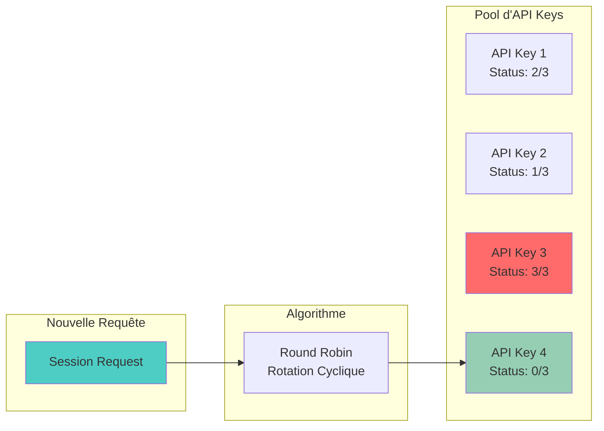

**Avantages :**
- Simple à implémenter
- Distribution équitable des charges
- Prévisible et déterministe

**Inconvénients :**
- Ne tient pas compte de la charge réelle
- Peut router vers des API surchargées

### 2. **Rotation par Charge Optimisée**

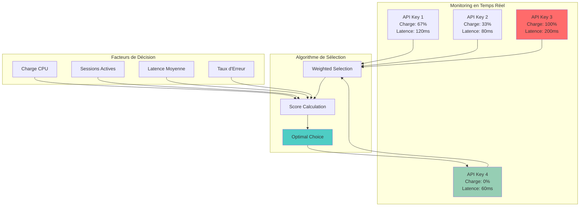

**Avantages :**
- Optimisation en temps réel
- Meilleure utilisation des ressources
- Adaptation automatique aux conditions

**Inconvénients :**
- Plus complexe à implémenter
- Nécessite un monitoring avancé

### 3. **Rotation par Zones Géographiques**

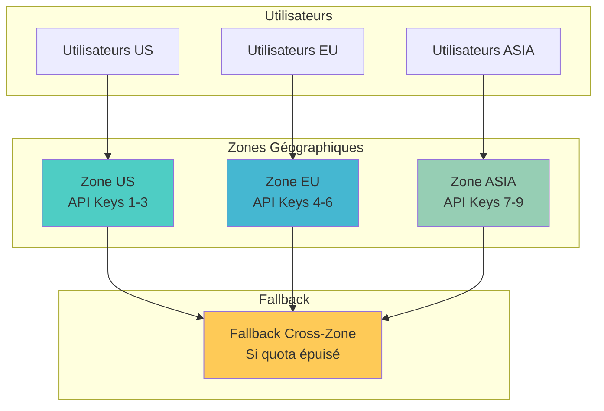

**Avantages :**
- Latence optimisée par région
- Isolation des pannes par zone
- Conformité réglementaire

**Inconvénients :**
- Gestion complexe des fallbacks
- Coûts d'infrastructure plus élevés

---

## 📊 Métriques et Monitoring

### Dashboard de Monitoring Recommandé

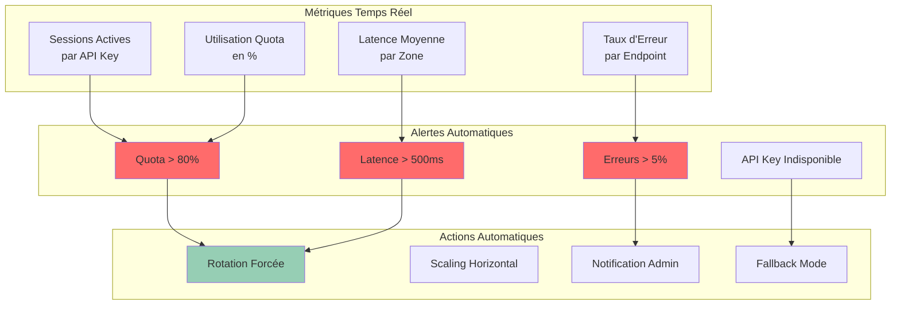

### KPIs Essentiels

| Métrique | Seuil Critique | Action |
|----------|----------------|---------|
| **Utilisation Quota** | > 80% | Rotation automatique |
| **Latence API** | > 500ms | Changement d'API Key |
| **Taux d'Erreur** | > 5% | Investigation + Fallback |
| **Sessions Simultanées** | Proche de la limite | Limitation nouvelles sessions |
| **Disponibilité** | < 99% | Escalade vers équipe technique |

---

## 🛠️ Plan de Migration

### Roadmap Complète de Migration

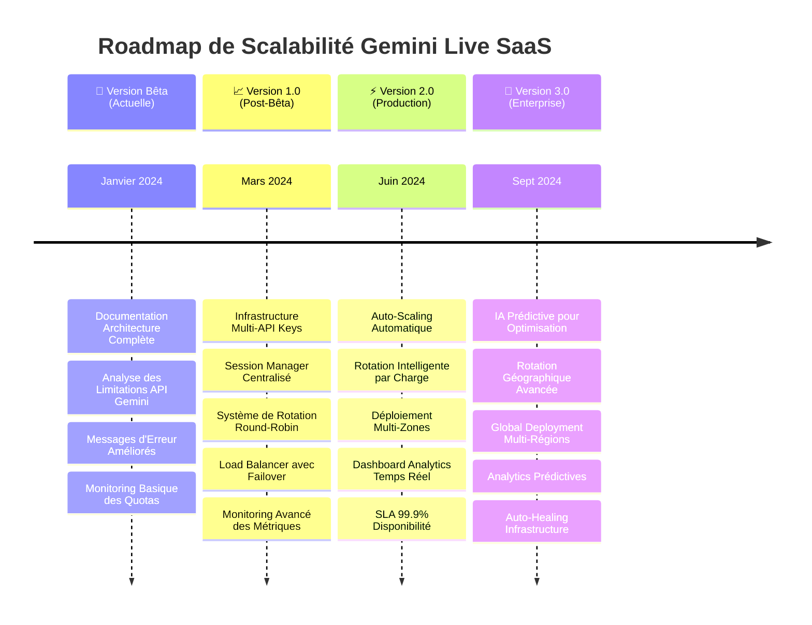

### Phase 1 : Préparation (Version Bêta Actuelle)
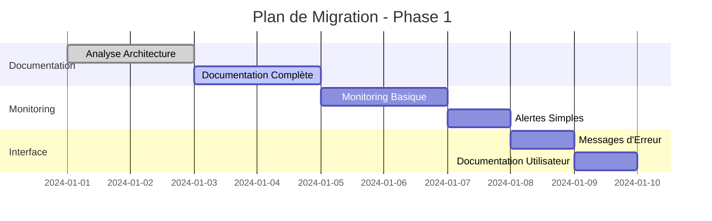

**Objectifs Phase 1 :**
- ✅ Documentation complète de l'architecture
- ✅ Monitoring basique des quotas
- ✅ Messages d'erreur explicites
- ✅ Interface utilisateur informative

### Phase 2 : Infrastructure Multi-API (Post-Bêta)
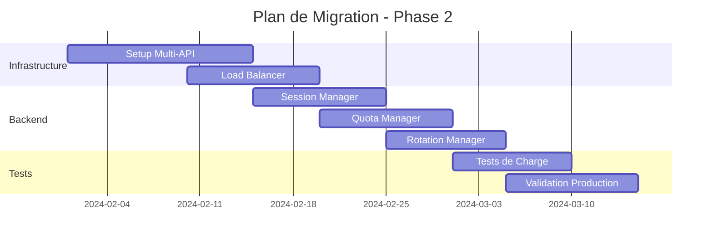

**Objectifs Phase 2 :**
- 🔄 Infrastructure multi-API Keys
- 🔄 Système de rotation intelligent
- 🔄 Monitoring avancé
- 🔄 Tests de charge complets

### Phase 3 : Optimisation et Scaling (Production)
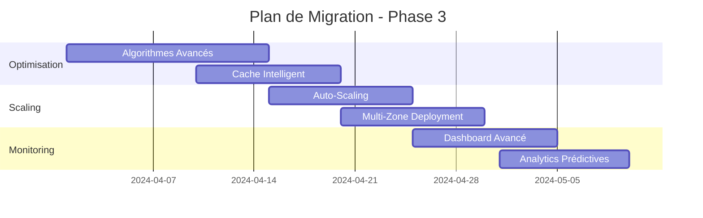

**Objectifs Phase 3 :**
- 🚀 Auto-scaling automatique
- 🚀 Déploiement multi-zones
- 🚀 Analytics prédictives
- 🚀 Optimisation continue

---

## 💰 Considérations Économiques

### Modèle de Coûts Multi-API

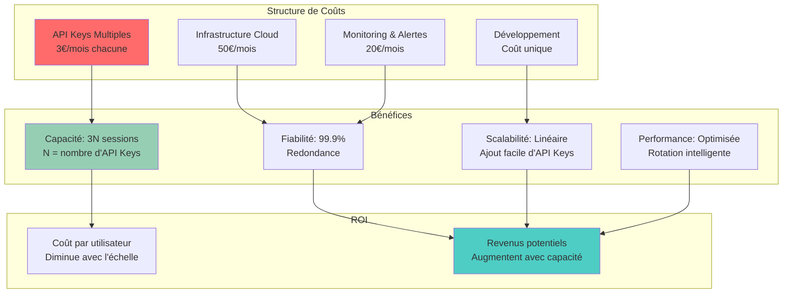

### Calcul de Rentabilité

| Nombre d'API Keys | Coût Mensuel | Capacité (Sessions) | Coût par Session |
|-------------------|--------------|---------------------|------------------|
| 1 | 3€ | 3 | 1€ |
| 5 | 15€ | 15 | 1€ |
| 10 | 30€ | 30 | 1€ |
| 20 | 60€ | 60 | 1€ |

**Point d'équilibre :** Avec un abonnement utilisateur à 10€/mois, le système devient rentable dès 6 utilisateurs actifs simultanés.

---

## 🔒 Sécurité et Conformité

### Gestion Sécurisée des API Keys

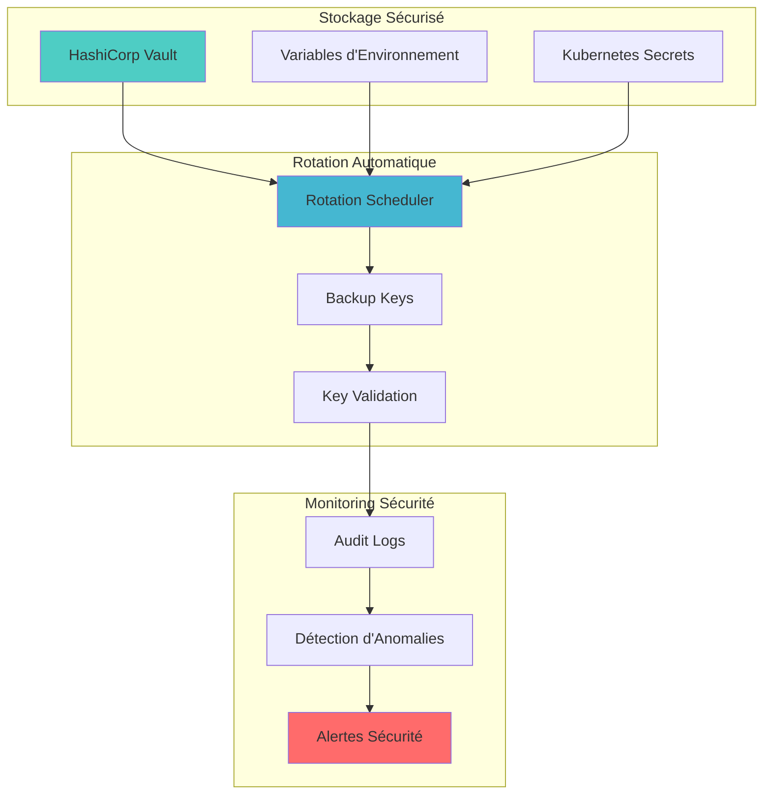

### Bonnes Pratiques Sécurité

1. **Chiffrement des API Keys** : Stockage chiffré avec rotation automatique
2. **Principe du moindre privilège** : Accès limité aux composants nécessaires
3. **Audit complet** : Logging de toutes les opérations sensibles
4. **Monitoring des anomalies** : Détection automatique d'usages suspects
5. **Backup et récupération** : Procédures de récupération en cas de compromission

---

## 📈 Métriques de Performance

### Benchmarks Cibles

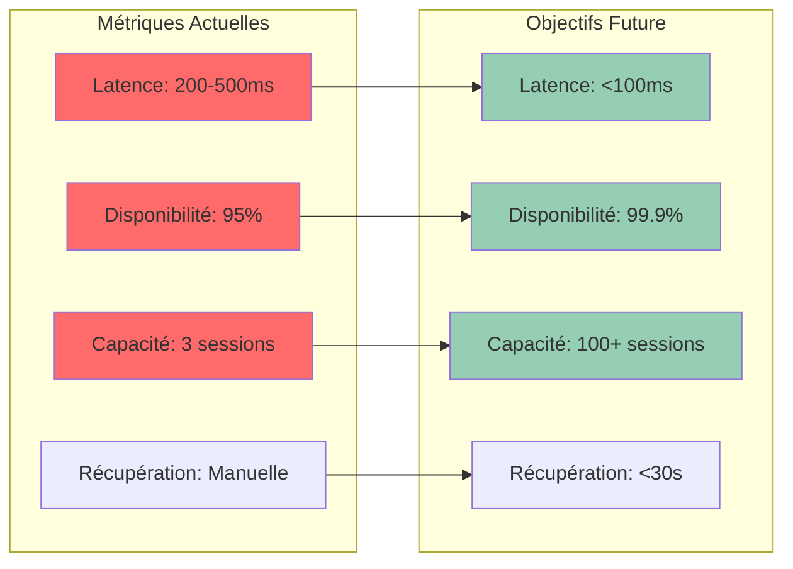

### SLA Recommandés

| Métrique | Objectif | Mesure |
|----------|----------|---------|
| **Disponibilité** | 99.9% | Uptime mensuel |
| **Latence P95** | <100ms | Temps de réponse API |
| **Récupération** | <30s | Temps de failover |
| **Capacité** | 100+ sessions | Sessions simultanées |
| **Précision** | >99% | Taux de succès des requêtes |

---

## 🎯 Conclusion et Recommandations

### Stratégie Recommandée pour la Version Bêta

Pour la **version bêta de démonstration**, nous recommandons de :

1. **📚 Documenter clairement** les limitations actuelles
2. **🔍 Implémenter un monitoring basique** des quotas
3. **💬 Améliorer les messages d'erreur** pour une meilleure UX
4. **🏗️ Préparer l'architecture** pour la scalabilité future

### Comparaison Architecture Actuelle vs Future

```mermaid
graph TB
    subgraph "🔴 ARCHITECTURE ACTUELLE - Limitations"
        subgraph "Frontend"
            UI1[Audio Interface]
            UI2[Video Interface]
            UI3[Screen Interface]
        end

        subgraph "Backend Simple"
            WS[WebSocket /ws/{id}]
            CONN[GeminiConnection]
        end

        subgraph "API Gemini"
            G1[Session 1]
            G2[Session 2]
            G3[Session 3]
            G4[❌ QUOTA EXCEEDED]
        end

        UI1 --> WS
        UI2 --> WS
        UI3 --> WS
        WS --> CONN
        CONN --> G1
        CONN --> G2
        CONN --> G3
        CONN --> G4

        style G4 fill:#ff6b6b
        style CONN fill:#ffcccc
    end

    subgraph "🟢 ARCHITECTURE FUTURE - Scalable"
        subgraph "Frontend Layer"
            WEB[Web App]
            MOBILE[Mobile App]
            API_CLI[API Clients]
        end

        subgraph "Gateway & Management"
            GATEWAY[API Gateway]
            SESSION_MGR[Session Manager]
            QUOTA_MGR[Quota Manager]
            ROTATION_MGR[Rotation Manager]
        end

        subgraph "Backend Cluster"
            B1[Backend 1<br/>API Key A]
            B2[Backend 2<br/>API Key B]
            B3[Backend 3<br/>API Key C]
            BN[Backend N<br/>API Key N]
        end

        subgraph "Gemini API Cluster"
            GA[Gemini A<br/>3 sessions]
            GB[Gemini B<br/>3 sessions]
            GC[Gemini C<br/>3 sessions]
            GN[Gemini N<br/>3 sessions]
        end

        WEB --> GATEWAY
        MOBILE --> GATEWAY
        API_CLI --> GATEWAY

        GATEWAY --> SESSION_MGR
        SESSION_MGR --> QUOTA_MGR
        QUOTA_MGR --> ROTATION_MGR

        ROTATION_MGR --> B1
        ROTATION_MGR --> B2
        ROTATION_MGR --> B3
        ROTATION_MGR --> BN

        B1 --> GA
        B2 --> GB
        B3 --> GC
        BN --> GN

        style SESSION_MGR fill:#4ecdc4
        style QUOTA_MGR fill:#45b7d1
        style ROTATION_MGR fill:#96ceb4
        style GA fill:#96ceb4
        style GB fill:#96ceb4
        style GC fill:#96ceb4
    end
```

### Roadmap Future

```mermaid
timeline
    title Roadmap de Scalabilité Gemini Live

    section Version Bêta
        Janvier 2024 : Documentation complète
                     : Monitoring basique
                     : Messages d'erreur améliorés

    section Version 1.0
        Mars 2024    : Infrastructure multi-API
                     : Système de rotation
                     : Load balancing

    section Version 2.0
        Juin 2024    : Auto-scaling
                     : Multi-zones
                     : Analytics avancées

    section Version 3.0
        Sept 2024    : IA prédictive
                     : Optimisation automatique
                     : Global deployment
```

### Points Clés à Retenir

1. **🎯 Pragmatisme** : Commencer simple avec la documentation et le monitoring
2. **🔄 Évolutivité** : Préparer l'architecture pour une croissance future
3. **💰 Économie** : Le modèle multi-API devient rentable rapidement
4. **🔒 Sécurité** : Intégrer la sécurité dès la conception
5. **📊 Monitoring** : Visibilité complète sur les performances et l'utilisation

Cette approche permet de **livrer une version bêta stable** tout en préparant le terrain pour une **scalabilité robuste** lorsque l'API Gemini sortira de sa phase expérimentale.

---

*Document créé le : Janvier 2024*
*Version : 1.0*
*Auteur : Architecture Team - Gemini Live SaaS*
