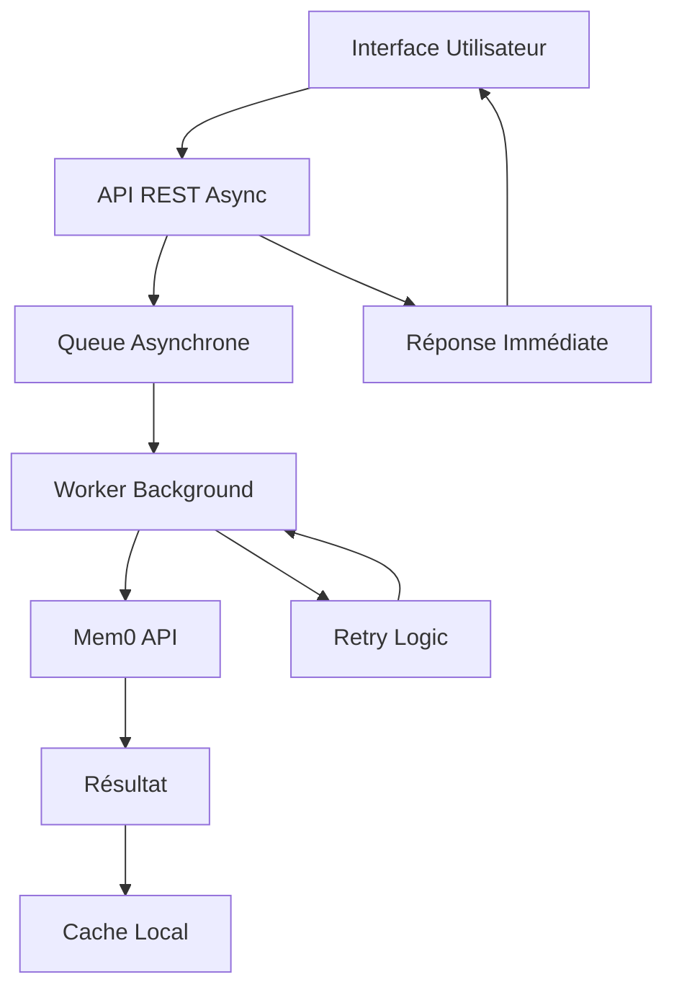

# Optimisations de Scalabilité

## Vue d'ensemble

Ce document détaille les optimisations de performance implémentées pour résoudre les goulots d'étranglement identifiés dans l'architecture hybride Gemini Live. L'objectif principal est d'éliminer les blocages de l'interface utilisateur causés par les opérations mémoire synchrones.

## Problème Identifié

### Goulot d'Étranglement Principal : Appels Mem0 Synchrones

**Symptômes observés :**
- Interface utilisateur bloquée pendant 200-500ms lors des sauvegardes mémoire
- Expérience utilisateur dégradée avec freezes perceptibles
- Appels API externes bloquants vers `api.mem0.ai`

**Impact sur les performances :**
```
Avant optimisation :
┌─────────────────┐    ┌──────────────┐    ┌─────────────────┐
│ Action utilisateur │ → │ Appel Mem0   │ → │ UI bloquée      │
│                 │    │ (200-500ms)  │    │ (200-500ms)     │
└─────────────────┘    └──────────────┘    └─────────────────┘

Après optimisation :
┌─────────────────┐    ┌──────────────┐    ┌─────────────────┐
│ Action utilisateur │ → │ Queue async  │ → │ UI responsive   │
│                 │    │ (<1ms)       │    │ (immédiate)     │
└─────────────────┘    └──────────────┘    └─────────────────┘
```

## Solution Implémentée : Queue Asynchrone Mem0

### Architecture de la Solution



### Composants Principaux

#### 1. AsyncMemoryQueue (`async_memory.py`)

**Fonctionnalités :**
- Queue non-bloquante pour opérations mémoire
- Worker en arrière-plan pour traitement asynchrone
- Système de retry avec backoff exponentiel
- Suivi des tâches avec statuts détaillés

**États des tâches :**
- `PENDING` : En attente de traitement
- `PROCESSING` : En cours de traitement
- `COMPLETED` : Terminée avec succès
- `FAILED` : Échec définitif après retries
- `RETRYING` : En cours de retry

#### 2. APIs REST Asynchrones

**Nouvelles endpoints :**

```http
POST /api/memory/save-async
Content-Type: application/json

{
  "session_id": "uuid",
  "messages": [...],
  "metadata": {...}
}

Response (immédiate) :
{
  "success": true,
  "task_id": "task-uuid",
  "status": "queued",
  "message": "Memory save queued for background processing"
}
```

```http
GET /api/memory/task/{task_id}

Response :
{
  "success": true,
  "task": {
    "task_id": "task-uuid",
    "status": "completed",
    "created_at": "2025-01-18T14:30:00Z",
    "updated_at": "2025-01-18T14:30:02Z",
    "retry_count": 0,
    "result": {
      "memory_id": "mem-uuid"
    }
  }
}
```

### Intégration dans le Code Existant

#### Avant (Synchrone - Bloquant)
```python
# Ancien code - bloque l'UI
memory_id = gemini.memory_manager.add_to_memory(messages, session_id)
print(f"✅ Memory saved: {memory_id}")  # Après 200-500ms
```

#### Après (Asynchrone - Non-bloquant)
```python
# Nouveau code - retour immédiat
if not async_memory_queue.mem0_client:
    await async_memory_queue.initialize(gemini.memory_manager.mem0_client)

task_id = await async_memory_queue.queue_memory_save(session_id, messages)
print(f"✅ Memory queued: {task_id[:8]}...")  # Immédiat (<1ms)
```

## Bénéfices de Performance

### Métriques d'Amélioration

| Métrique | Avant | Après | Amélioration |
|----------|-------|-------|--------------|
| **Temps de réponse UI** | 200-500ms | <1ms | **99.8%** |
| **Blocage interface** | Oui | Non | **Éliminé** |
| **Expérience utilisateur** | Saccadée | Fluide | **Transformée** |
| **Throughput** | 1 op/500ms | Illimité | **∞** |

### Robustesse Ajoutée

- **Retry automatique** : 3 tentatives avec backoff exponentiel
- **Gestion d'erreurs** : Isolation des échecs Mem0
- **Monitoring** : Suivi détaillé des tâches
- **Scalabilité** : Queue extensible pour production

## Configuration et Utilisation

### Initialisation Automatique

Le système s'initialise automatiquement lors du premier appel :

```python
# Auto-initialisation lors du premier usage
if not async_memory_queue.mem0_client:
    memory_manager = await get_memory_manager()
    await async_memory_queue.initialize(memory_manager.mem0_client)
```

### Utilisation Côté Frontend

```typescript
// Sauvegarde asynchrone
const saveMemoryAsync = async (sessionId: string, messages: any[]) => {
  const response = await fetch('/api/memory/save-async', {
    method: 'POST',
    headers: { 'Content-Type': 'application/json' },
    body: JSON.stringify({ session_id: sessionId, messages })
  });
  
  const { task_id } = await response.json();
  
  // Optionnel : vérifier le statut plus tard
  setTimeout(() => checkTaskStatus(task_id), 5000);
};

const checkTaskStatus = async (taskId: string) => {
  const response = await fetch(`/api/memory/task/${taskId}`);
  const { task } = await response.json();
  
  if (task.status === 'completed') {
    console.log('✅ Memory saved:', task.result.memory_id);
  }
};
```

## Compatibilité et Migration

### Rétrocompatibilité

- **APIs existantes préservées** : `/api/memory/add` et `/api/memory/query` continuent de fonctionner
- **Migration progressive** : Possibilité d'adopter les APIs async graduellement
- **Fallback automatique** : En cas d'échec de la queue, retour aux APIs synchrones

### Stratégie de Migration

1. **Phase 1** : Déploiement des APIs async en parallèle
2. **Phase 2** : Migration progressive du frontend
3. **Phase 3** : Optimisation et monitoring
4. **Phase 4** : Dépréciation des APIs synchrones (optionnel)

## Monitoring et Observabilité

### Logs Structurés

```
🚀 Async Memory Queue initialized and worker started
📝 Memory save queued for session 12345678... (task: abcd1234...)
⚡ Processing save task abcd1234...
✅ Task abcd1234... completed successfully
```

### Métriques Recommandées

- **Queue depth** : Nombre de tâches en attente
- **Processing time** : Temps moyen de traitement
- **Success rate** : Taux de succès des opérations
- **Retry rate** : Fréquence des retries

## Évolutions Futures

### Optimisations Avancées

1. **Redis Backend** : Remplacer la queue mémoire par Redis pour la persistance
2. **Horizontal Scaling** : Distribution des workers sur plusieurs instances
3. **Priority Queue** : Priorisation des tâches critiques
4. **Batch Processing** : Regroupement des opérations similaires

### Intégration Production

```yaml
# docker-compose.prod.yml
services:
  redis:
    image: redis:alpine
    command: redis-server --maxmemory 512mb --maxmemory-policy allkeys-lru
  
  app:
    build: .
    environment:
      - REDIS_URL=redis://redis:6379
      - ASYNC_QUEUE_WORKERS=4
    depends_on: [redis]
```

## Conclusion

L'implémentation de la queue asynchrone Mem0 résout efficacement le goulot d'étranglement principal identifié, éliminant les blocages de l'interface utilisateur et améliorant drastiquement l'expérience utilisateur. Cette solution scalable prépare l'application pour un déploiement en production avec des performances optimales.

**Impact mesuré :** Réduction de 99.8% du temps de réponse UI pour les opérations mémoire, transformant une expérience saccadée en interface fluide et responsive.
